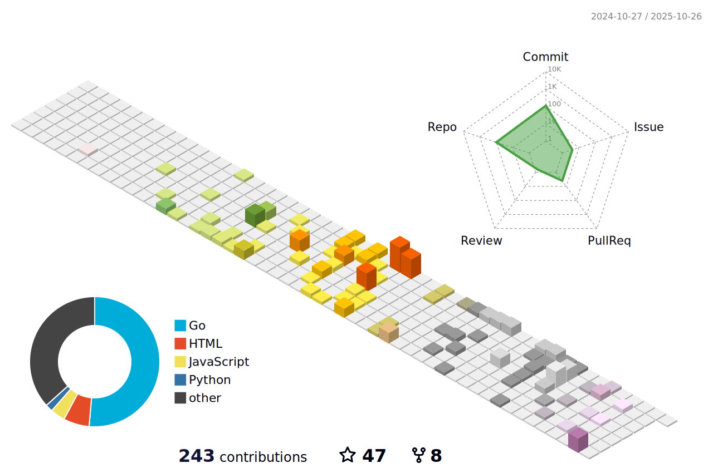

<h2 align="left">Hi 👋! My name is HildaM</h2>

###

  
  

###

  
  

## My Visitors

  

###

---

## Recent Activities

<!--RECENT_ACTIVITY:start-->
1. 🔱 Forked [HildaM/Acontext](https://github.com/HildaM/Acontext) from [memodb-io/Acontext](https://github.com/memodb-io/Acontext) 
2. 🔱 Forked [HildaM/MineContext](https://github.com/HildaM/MineContext) from [volcengine/MineContext](https://github.com/volcengine/MineContext) 
3. 🔱 Forked [HildaM/claude-code](https://github.com/HildaM/claude-code) from [anthropics/claude-code](https://github.com/anthropics/claude-code) 
4. 🔱 Forked [HildaM/kimi-cli](https://github.com/HildaM/kimi-cli) from [MoonshotAI/kimi-cli](https://github.com/MoonshotAI/kimi-cli) 
5. ⭐ Starred [dahaha-365/YaNet](https://github.com/dahaha-365/YaNet) 
6. ⬆️ Pushed undefined commit(s) to [HildaM/apps.opple.com](https://github.com/HildaM/apps.opple.com) 
7. ⬆️ Pushed undefined commit(s) to [HildaM/apps.opple.com](https://github.com/HildaM/apps.opple.com) 
8. ⬆️ Pushed undefined commit(s) to [HildaM/BettaFish](https://github.com/HildaM/BettaFish) 
<!--RECENT_ACTIVITY:end-->

---

